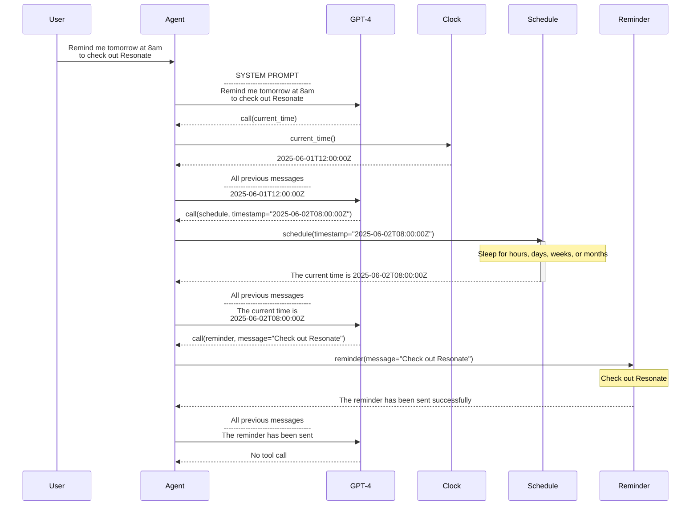

# Reminder Assistant
## Dead Simple Autononomous Agents with Resonate's Distributed Async Await

An autonomous, long-running **Reminder Assistant** powered by OpenAI and Resonate's Distributed Async Await.

# Overview

The Reminder Assistant allows users to schedule reminders through natural language:

```
Remind me first thing in the morning, bright and early, to check out https://resonatehq.io
```

The Reminder Assistant is implemented as an agent loop using the Resonate's Distributed Async Await. Distributed Async Await enables durable suspension and resumption of long-lived executions.

With Distributed Async Await, the scheduling logic is dead simple:
- The schedule function yields/sleeps until the target time
- The system automatically resumes when the timer expires
- The AI then immediately sends the reminder



# Stateful Agent = Stateless Agent + Stateful Execution

The AI Agent does not keep track of state or time, all of which is handled by Resonate: The Agent is part of a durable runtime that can wait hours, days, or weeks and still complete the task. The runtime wakes the Agent when it's time to act.

This eliminates the need for traditional scheduling infrastructure like cron jobs, message queues, or databases.

## Open AI GPT-4 & Tool Calls

The assistant leverages OpenAI’s gpt-4 model with structured function calls.

**System Prompt**

```
You are a helpful assistant that schedules reminders using three tools: 'schedule', 'reminder', and 'current_time'.

Users may express reminder requests ambiguously (e.g., "tomorrow morning, bright and early"). Use your best judgment to interpret such time expressions. Do not ask for clarification.

When a user asks for a reminder:

1. Call the 'schedule' tool with the desired UTC timestamp. This pauses the conversation until that time.
2. Once the system resumes and sends you the next message, the scheduled time has arrived.
3. At that point, immediately call the `reminder` tool to send the message.

If needed, use the `current_time` tool to compute a future time.

Remember:

**you do not keep track of time.**

You are part of a durable system that can wait hours, days, or weeks and still complete the task. The system will wake you when it is time to act. Your job is to determine what to do next.
```

The model autonomously chooses from these tools:

**Tool Calls**

| Tool         | Purpose                                         |
|--------------|-------------------------------------------------|
| schedule     | Sleep until a given UTC time in ISO 8601 format |
| reminder     | Send a message as a reminder                    |
| current_time | Return current UTC time in ISO 8601 format      |

## Resonate

The core interaction between GPT and the tools happens inside a Resonate function. The assistant repeatedly:

### Agent Loop

```
@resonate.register
def schedule_reminder(ctx, question, max_steps=5):
    messages = [
        {"role": "system", "content": SYSTEM_PROMPT},
        {"role": "user", "content": question}
    ]

    for step in range(max_steps):
        response = aiclient.chat.completions.create(
            model="gpt-4-1106-preview",
            messages=messages,
            tools=TOOLS,
            tool_choice="auto"
        )

        message = response.choices[0].message
        messages.append(message)

        if message.tool_calls:
            for tool_call in message.tool_calls:
                tool_name = tool_call.function.name
                tool_args = json.loads(tool_call.function.arguments)

                handler = None
                match tool_name:
                    case "schedule":
                        handler = schedule
                    case "reminder":
                        handler = reminder
                    case "current_time":
                        handler = current_time
                    case _:
                    raise ValueError(f"Unknown tool: {tool_name}")

                result = yield ctx.lfc(handler, tool_args)

                messages.append({"role": "tool", "tool_call_id": tool_call.id, "content": result})
        else:
            break
```

### Durable Suspension and Durable Resumption

Besides LLM, the highlight of this system is Resonate’s durable execution model.

When the assistant calls:

```
def schedule(ctx, args):
  yield ctx.sleep(...)
```

Resonate
- Suspends the computation
- Waits for hours, days, weeks, or months
- Resumes the computation－even on a different process

**A procedural programming model on top of an event driven execution model. No databases, no queues, no timers, no polling—just functions and promises

## Installation & Usage

This project uses uv, a popular Python package manager and virtual environment tool.

### 1. Clone the repository

```
git clone https://github.com/resonatehq/reminder-assistant.git
cd reminder-assistant
```

### 2.  Setup environment

```
uv sync
```

### 3. Set your OpenAI API Key

```
export OPENAI_API_KEY="sk-..."
```

### 4. Run the Agent

```
python reminder_assistant.py
```

You can test the agent by modifying the prompt at the bottom of the file:

```
handle = schedule_reminder.run("remindme.1", "Remind me tomorrow at 8am to check out Resonate")
result = handle.result()
```
